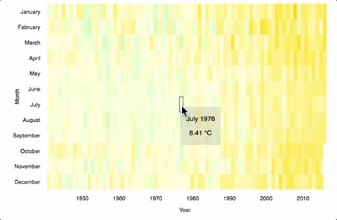

# D3

Various types of data visualizations built with [D3.js](https://d3js.org/).

## Histogram

US Gross Domestic Product by quarter, over time

Hover over a bar and see a tooltip with the GDP amount and exact year and month that bar represents

[View demo](http://codepen.io/jennhsu/full/WGKdZV/)

## Scatterplot

Doping in Professional Bicycle Racing - Fastest times up Alpe d'Huez

Hover over a datapoint to see a tooltip with additional details

[View demo](http://codepen.io/jennhsu/full/jrvwmv/)

## Heat Map

Heat map with months and years represented on the Y and X axes respectively

Each cell is colored based its relative temperature

Hover over a cell in the heat map to get more exact information

[View demo](http://codepen.io/jennhsu/full/NRLvvQ/)

## Force Directed Graph

Force-directed graph that shows which countries share borders

Graph is draggable

Hover over a datapoint to see a tooltip with country's name

[View demo](http://codepen.io/jennhsu/full/ALPGrz/)

## Data Map

Locations of landed meteorites on a world map

Relative size of datapoint is related to the size of the meteorite

Hover over the meteorite for more information about the meteorite

[View demo](http://codepen.io/jennhsu/full/gwBzqk/)
